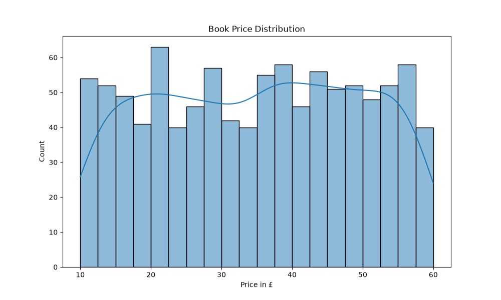
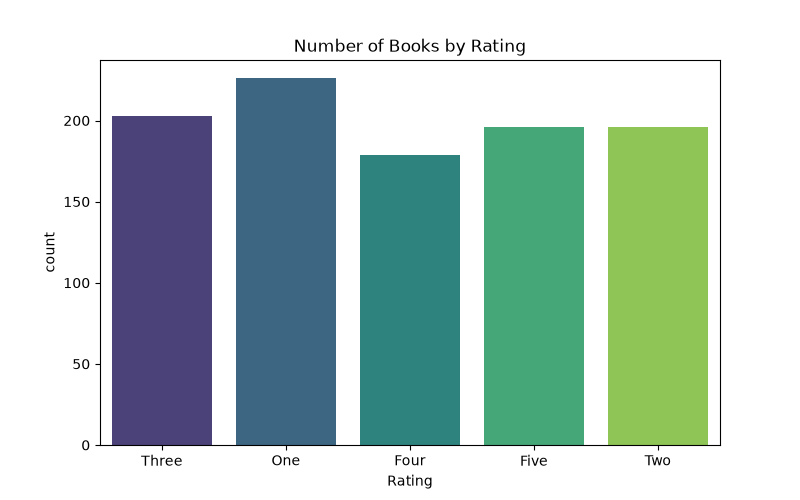

# code-alpha-task3-Data-Visualization


## About
This project visualizes the Books Dataset using Python, Matplotlib, and Seaborn.

## Graphs Included
1. **Price Distribution**
   Shows how book prices are distributed. Most books are priced under £20.
   

2. **Rating Count**
   Shows number of books for each rating. Most books have 4-star rating.
   

## How to Run
```bash
pip install matplotlib seaborn pandas
python visualization.py
